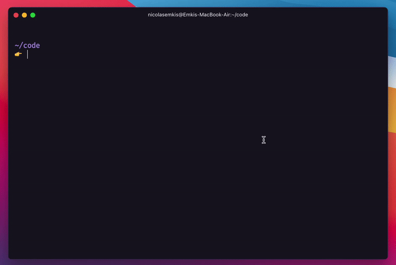

<div align="center">
  <h1>Hyper guide</h1>
  <p>Below you can see a preview of how this setup looks like.</p>
  
  
  <br>
  <br>
</div>


## Terminal
[Hyper](https://hyper.is), is a beautiful Electron-based terminal.

> Using Hypes is not a requirement for this setup, you can use all these tools on this guide with your own terminal.

To install Hyper, just run the command:
```bash
brew install --cask hyper
```


## Hyper configs
You can find the configurations I use for Hyper in [this file](./hyper.js), you can copy paste in your `~/.hyper.js` file, and after opening Hyper, all plugins will be installed correctly.


## Installing the Fira Code font
Run the command:
```bash
brew tap homebrew/cask-fonts
brew install --cask font-fira-code
```


## Installing Zsh
If you are using the last version of MacOS, you already have Zsh installed by default. Run the command:
```bash
# to check if you have it installed already
zsh --version
# if you don't, install it with
brew install zsh
```


## Installing Oh My Zsh
The [Oh My Zsh](https://ohmyz.sh) is a framework for Zsh that standardizes how we can configure themes, plugins and so on. Run the command:
```bash
sh -c "$(curl -fsSL https://raw.githubusercontent.com/ohmyzsh/ohmyzsh/master/tools/install.sh)"
```


## Installing plugins and theme for Oh My Zsh
Below is the list of the plugins and the theme I use. If you want to add your own configuration, you can check the [Plugins](https://github.com/ohmyzsh/ohmyzsh/wiki/Plugins) and [Themes](https://github.com/ohmyzsh/ohmyzsh/wiki/Themes) docs.

Adding [zsh-syntax-highlighting](https://github.com/zsh-users/zsh-syntax-highlighting) plugin.
```bash
brew install zsh-syntax-highlighting
```

Adding [zsh-autosuggestions](https://github.com/zsh-users/zsh-autosuggestions) plugin.
```bash
brew install zsh-autosuggestions
```

Adding [zsh-completions](https://github.com/zsh-users/zsh-completions) plugin.
```bash
brew install zsh-completions
```

Adding [Spaceship](https://github.com/denysdovhan/spaceship-prompt) theme.
```bash
brew install spaceship
```


## Adding configs to Oh My Zsh
Now you need to define the configurations for Oh My Zsh. To do that, open your `~/.zshrc` file.

With this file open, copy the content of [this file](./.zshrc), paste it, and save it.


## Adding configs to Spaceship theme
Now you need to create the theme configuration file. To create this file run the command:
```bash
touch ~/.spaceshiprc.zsh
```

Now open this file, copy the content of [this file](./.spaceshiprc.zsh), paste it, and save it.


## Done
After all these steps, everything should be ready and working as expected, enjoy ✨.
