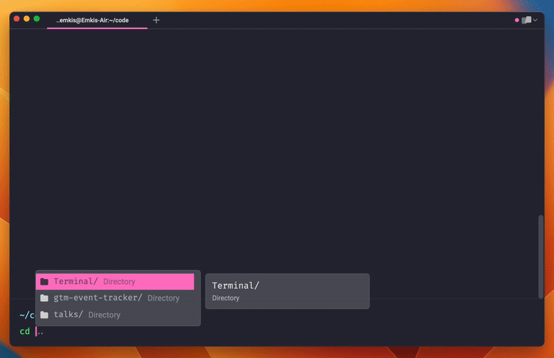

  <h1>Environment</h1>
  
All scripts and configurations I rely on to ensure my setup is always consistent between devices, it covers from Mac dock settings to Window management.

  
   
   

> **Note**: All the configuration here is MacOS-specific, some things might work on Linux as well, but you would need to figure it out by yourself.

## Recipes

As there are many things to setup, all things to setup are separated by a recipe, follow the instructions of each folder to understand which steps are required.

**When setting up a new device**, that's the recommended recipe order:

1. Setting up [Core dependencies](./recipes/setting-up-core-dependencies/)
2. Setting up [Bluetooth devices](./recipes/setting-up-bluethooth-devices/)
3. Setting up [Window manager](./recipes/setting-up-window-manager/)
4. Setting up [User apps](./recipes/setting-up-user-apps/)
5. Setting up [Dev environment](./recipes/setting-up-dev-env/)
6. Coming...
