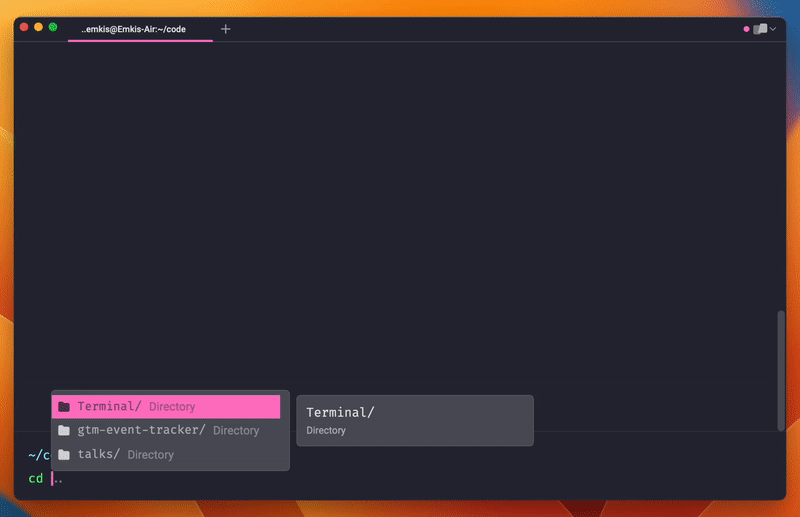

  <h1>Environment</h1>
  
All scripts and configurations I rely on to ensure my setup is always consistent between devices, it covers from Mac dock settings to Window management.

  
   
   

> **Note**: All the configuration here is MacOS-specific, some things might work on Linux as well, but you would need to figure it out by yourself.
