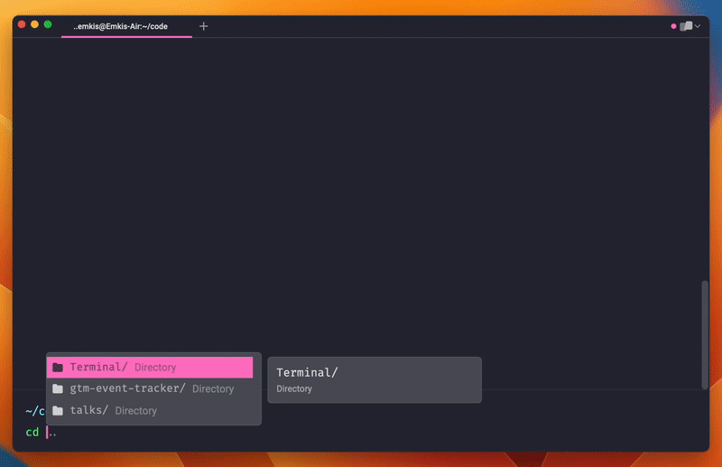

<div align="center">
  <h1>Environment</h1>
  <p>All scripts and configurations I rely on to ensure my setup is always consistent between devices, it covers from Mac dock settings to Window management.</p>
  
  <br>
  <br>
</div>

> **Note**: All the configuration here is MacOS-specific, some things might work on Linux as well, but you would need to figure it out by yourself.

## Setup

Two steps, in this order.

**1. Bootstrap** — installs Homebrew and Bun, the only things `chest` itself needs:

```bash
./bootstrap.sh
```

**2. chest** — checks this machine against the Manifest and installs what you pick:

```bash
ENVIRONMENT_REPOSITORY="$(pwd)" ./bin/chest
```

`chest` takes no arguments. Every run is a full Sweep: it checks every Entry live, scans `bin/`
for drifted scripts, shows everything grouped by Category, and offers an interactive picker with
missing and drifted items pre-checked. Run it on a brand-new Mac, run it to see what's missing,
run it after editing a config file — same command every time.

Once `config.fish` is installed, `ENVIRONMENT_REPOSITORY` is set for you and `chest` is on your
`PATH`, so later runs are just:

```bash
chest
```

Steps that can't be automated live in [MANUAL-STEPS.md](./MANUAL-STEPS.md). `chest` points you at
the relevant ones as it goes.

## Layout

- `packages/chest` — the CLI: Engine, Manifest (one file per Category), and Config entries' sources.
- `packages/{ide,llmt,vspeed}` — independent tools.
- `bin/` — thin launcher shims, synced into `$GLOBAL_BINS` by the Bin scan.
- `recipes/managing-backups` — the rclone backup job, run on its own.
- `utilities/` — one-off utilities.
